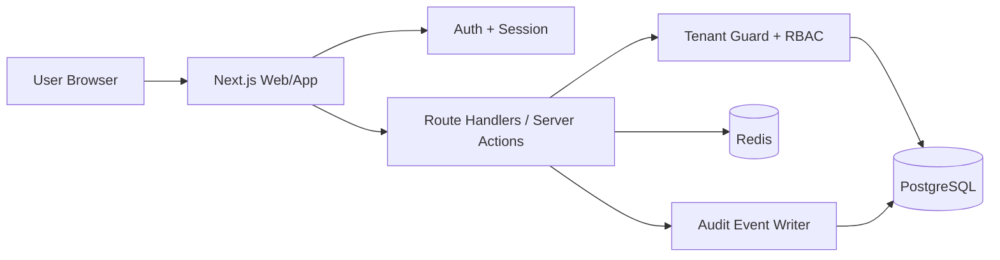

# ADR-001: PeopleFlow HR MVP Stack and Multitenancy Architecture

Date: 2026-03-13  
Status: Accepted (MVP)  
Issue: SAV-9

## 1. Context
PeopleFlow HR MVP must support multiple tenant organizations with strict isolation, role-based access, and a clear path to scale without major re-architecture in early milestones.

## 2. Decisions

### 2.1 Final stack (MVP)
- Frontend: Next.js 15 (App Router) + TypeScript + Tailwind CSS.
- Backend: Next.js Route Handlers + Server Actions for MVP API surface.
- Database: PostgreSQL 16.
- Auth: Better Auth (email/password + magic link), tenant membership in app DB.
- Cache/queues: Redis (BullMQ-ready) for async jobs and notifications.
- Infra target: Docker Compose locally, then Coolify deployment.

Rationale:
- Single TypeScript runtime accelerates delivery for Steps 10-11.
- PostgreSQL provides robust constraints and indexing for tenant-safe queries.
- Redis allows incremental move from sync flows to background processing.

### 2.2 Multitenancy model (MVP)
- Model: shared database, shared schema, mandatory `tenant_id` on tenant-owned tables.
- `tenant_id` type: UUID.
- Every business query must include tenant scoping before role checks.
- Global/system tables (feature flags, platform configs) remain non-tenant.

Rationale:
- Fastest model for MVP while keeping low operational overhead.
- Supports future migration to schema-per-tenant for large accounts.

### 2.3 RBAC model
- Roles: `tenant_admin`, `manager`, `employee`.
- Membership source of truth: `memberships(user_id, tenant_id, role, status)`.
- Authorization sequence:
  1. Resolve active tenant context from membership/session.
  2. Apply tenant filter (`tenant_id = context.tenant_id`).
  3. Apply role permissions.
  4. Apply relation checks (for example manager-direct-report, employee-self).

### 2.4 Tenant isolation guardrails
- Database layer:
  - Composite unique keys include `tenant_id` where applicable.
  - Foreign keys include tenant-owned references and consistent `tenant_id` invariants.
  - Optional Postgres RLS-ready column conventions kept from day one.
- Application layer:
  - Central query helpers require tenant context argument.
  - API handlers reject requests with missing tenant context.
  - No direct raw SQL in route handlers without tenant guard wrapper.
- Testing layer:
  - Cross-tenant negative tests for all read/write endpoints.
  - Regression suite asserting no data leakage under concurrent tenant traffic.
- Observability layer:
  - Audit events include `tenant_id`, actor, action, entity, timestamp.
  - Error logs scrub PII and retain tenant correlation IDs.

## 3. Domain model baseline (MVP)
- `tenants`
- `memberships`
- `employees`
- `departments`
- `leave_requests`
- `approval_events`
- `audit_events`

Tenant-owned tables include `tenant_id`, `created_at`, `updated_at`, and actor metadata where required.

## 4. High-level architecture diagram

## 5. Migration path (post-MVP)
- Phase 1 (current): shared schema + `tenant_id` + strict app-level guardrails.
- Phase 2: enable Postgres RLS policies per tenant-owned table.
- Phase 3: introduce tenant partitioning for high-volume tables (`leave_requests`, `audit_events`).
- Phase 4: selective schema-per-tenant or database-per-tenant for enterprise tenants requiring isolation/SLA customization.

## 6. Risks and mitigations
- Risk: accidental unscoped query in new endpoint.
  - Mitigation: mandatory query helper + lint rule + code review checklist + leakage tests.
- Risk: role escalation due to stale membership cache.
  - Mitigation: short-lived session claims + membership re-check on privileged actions.
- Risk: noisy-neighbor performance under shared schema.
  - Mitigation: tenant-aware indexes, rate limits, and future partitioning.
- Risk: migration complexity to stronger isolation model.
  - Mitigation: keep `tenant_id` and consistent keys from day one; avoid tenant-implicit joins.

## 7. Consequences
- Positive:
  - Fast implementation path for MVP and early customer validation.
  - Clear safety rails for tenant isolation.
  - Compatible with roadmap Steps 10 and 11.
- Trade-offs:
  - Requires strong discipline in query scoping until full RLS adoption.
  - Shared resources can create contention before partitioning.
